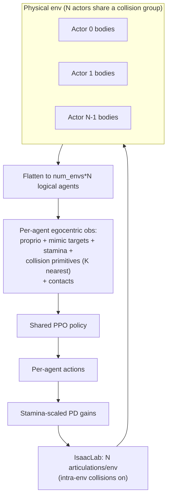

# Fighting-Game Mimic Extension

A tiered build on top of the existing mimic stack ([examples/experiments/mimic/mlp.py](examples/experiments/mimic/mlp.py)). Each phase is independently trainable and corresponds to one tier of your regimen. Target simulator is **IsaacLab** (your training backend); other backends are addressed only in the deployment phase.

## Core architectural decisions (from your answers)

- **Opponents = shared-policy self-play.** Each physical env contains `N` humanoid actors (config-driven, no hard cap). All actors run the **one** policy; each produces its own egocentric obs + action; all transitions feed a single PPO buffer. Internally, characters are flattened into the batch dimension (`num_envs x N` logical agents) so the existing single-agent PPO is reused unchanged.
- **Stamina = PROPORTIONAL control.** A new `smpl-proportional` robot config computes PD torques in Python with `[num_envs, num_dofs]` gain buffers scaled by per-body stamina. Existing `smpl` (BUILT_IN_PD) is left intact.
- **One sensory abstraction for the whole world.** Ground, obstacles, thrown objects, and other characters' key bodies are all encoded as 17-float egocentric collision primitives (your PDF spec), with `danger_level` replaced by `damage`.
- **Frozen observation architecture from Tier 1.** The **complete, final observation layout** (proprio + mimic targets + `K` collision-primitive slots + per-body stamina + contacts) is defined up front and the network shape never changes across tiers. In early tiers the interference features are **present but inert** (collision primitives = ground only, padded to `K`; stamina = 1.0; no opponents/projectiles). Because `MLPWithConcat` uses `nn.LazyLinear` + obs normalization, changing `in_keys` later would change the first-layer shape and break weight reuse — so we fix it once. Each tier then warm-starts cleanly from the previous checkpoint, and "enabling a tier" is a **data/environment knob**, not a model change.

## Data flow (multi-character, shared policy)

## Collision-primitive layout (17 floats, from the PDF)

Per primitive, egocentric to the observing character's heading-aligned hip frame, built with existing helpers `calc_heading_quat_inv` + `quat_rotate` + `quat_to_tan_norm` ([protomotions/utils/rotations.py](protomotions/utils/rotations.py)):

- `0:3` rel_pos, `3:6` rel_lin_vel, `6:9` local_tan, `9:12` local_norm, `12` radius, `13` extent_z, `14` **damage** (replaces danger_level), `15:16` shape one-hot `[is_box, is_sphere]` (capsule = `[0,0]`).
- Aggregation: sort active primitives by distance to root, take top-K, zero-pad to `K`, output `[num_agents, K*17]`. Ground always contributes at least one box primitive.
- Other characters contribute capsule primitives for **head, pelvis, arm, forearm, foot, shin** only (distance-filtered).

---

## Phase 0 — `smpl-proportional` robot + stamina plumbing

- Add [protomotions/robot_configs/smpl_proportional.py](protomotions/robot_configs/smpl_proportional.py): copy of [protomotions/robot_configs/smpl.py](protomotions/robot_configs/smpl.py) with `control_type=ControlType.PROPORTIONAL`; register `smpl-proportional` in the robot factory.
- Add a stamina-aware action fn in [protomotions/envs/action/action_functions.py](protomotions/envs/action/action_functions.py) (variant of `normalized_pd_fixed_gains_action`) returning `stiffness_targets`/`damping_targets` scaled by a per-body `stamina` vector.
- Wire gains through the step loop: [protomotions/envs/base_env/env.py](protomotions/envs/base_env/env.py) currently drops `stiffness_targets`/`damping_targets` (~lines 665-670). Store them and pass to the simulator.
- Extend the PROPORTIONAL path in [protomotions/simulator/base_simulator/simulator.py](protomotions/simulator/base_simulator/simulator.py) (`_apply_control`, `_finalize_setup`): make `_common_p_gains`/`_common_d_gains` accept `[num_envs, num_dofs]` and use per-step gains.
- **Validation:** a short `smpl-proportional` run (stamina fixed at 1.0) to confirm PROPORTIONAL control reaches tracking parity with the current `smpl` base. (The full **Tier 1 base model** is trained at the end of Phase 1, once the frozen final obs layout exists — see below.)

## Phase 1 — Collision-primitive observations + contacts (sensory swap)

- New kernel [protomotions/envs/obs/collision_primitives.py](protomotions/envs/obs/collision_primitives.py): pure tensor fn implementing the 17-float layout + top-K sort/pad. Level-2 / ONNX-exportable.
- Expose primitive sources on `EnvContext` ([protomotions/envs/context_views.py](protomotions/envs/context_views.py), [protomotions/envs/context_paths.py](protomotions/envs/context_paths.py)): ground box, scene-object states, projectile states, and (later) other-character key-body capsules — assembled in `_build_global_context()`.
- New factory `collision_primitives_obs_factory(K=...)` in [protomotions/envs/component_factories.py](protomotions/envs/component_factories.py).
- New mimic-fighting experiment [examples/experiments/mimic/fight.py](examples/experiments/mimic/fight.py): start from `mlp.py`, **remove** any ground/terrain height obs, **add** `collision_primitives` obs, and set `observe_contacts=True` on `max_coords_obs_factory` (flag already supported). Add the new keys to actor/critic `in_keys`. This experiment defines the **final, frozen observation layout** used by every later tier.
- `damage` field: static baseline for props; higher for designated weapon primitives; high for fast opponent limbs (computed from velocity, per your note).
- **Train the Tier 1 base model here, with interference inert:** collision primitives carry ground only (padded to `K`), stamina = 1.0, no projectiles/opponents, contacts observed. This produces a competent tracker whose network shape is identical to all downstream tiers, so Phases 2-5 warm-start from this checkpoint.

## Phase 2 — Thrown obstacles tier (animation interference + bracing)

- Reuse the built-in projectile system (`ProjectileConfig`, `_throw_projectile`, J-key) in [protomotions/simulator/base_simulator/config.py](protomotions/simulator/base_simulator/config.py) / `simulator.py`, plus static/dynamic ground obstacles via [protomotions/components/scene_lib.py](protomotions/components/scene_lib.py).
- **Randomized damage per thrown collider.** Each episode/throw, a **random number** of the active colliders (count sampled from a configurable range) get a **randomized `damage`** value (sampled from a configurable range); the rest stay at the static baseline. Damage is stored per-primitive so it flows into both the collision-primitive obs (index 14) and the impact reward below. This teaches the policy to treat colliders differently by danger rather than uniformly.
- New reward `body_impact_penalty_factory` in [protomotions/envs/component_factories.py](protomotions/envs/component_factories.py) using `impact_force_penalty` ([protomotions/envs/rewards/regularization.py](protomotions/envs/rewards/regularization.py)) bound to `EnvContext.current_contact_force_magnitudes`: penalize high-force contacts on all bodies **except hands/feet**, scaled by the colliding primitive's randomized `damage`.
- Enable random projectile/obstacle throwing during training (config flag). This is your **Tier 2** (interference + brace/avoid).

## Phase 3 — Reference re-anchoring (don't punish unavoidable interference)

- Turn on/extend `realign_motion_with_humanoid_on_each_step` ([protomotions/envs/motion_manager](protomotions/envs/motion_manager), [protomotions/envs/base_env/env.py](protomotions/envs/base_env/env.py) `align_motion_with_humanoid`): currently snaps reference XY to the robot each step.
- Extend to optionally re-anchor height and heading so the mimic target follows the character when physically displaced, per your "adjust animation offset" note. Applies consistently to `mimic.ref_state` + `mimic.future_*`.

## Phase 4 — Per-body stamina randomization tier

- Randomize a per-body `stamina` scalar per episode/env; feed it both to the Phase-0 gain scaling and as a new per-body obs scalar (extend an obs factory / add a small stamina obs kernel). This is your **Tier 3** (move correctly under changing drive strength).

## Phase 5 — Multi-character shared-policy self-play (largest, highest risk)

- **Simulator (IsaacLab first):** spawn `N` humanoid articulations per env sharing one collision group so they collide with each other but not across envs — [protomotions/simulator/isaaclab/utils/scene.py](protomotions/simulator/isaaclab/utils/scene.py), [protomotions/simulator/isaaclab/simulator.py](protomotions/simulator/isaaclab/simulator.py).
- **State/action tensors:** add a character dimension (`[num_envs, N, ...]`) to `RobotState`/`ResetState` ([protomotions/simulator/base_simulator/simulator_state.py](protomotions/simulator/base_simulator/simulator_state.py)); add a thin flatten/unflatten layer so the PPO agent sees `num_envs*N` logical agents and a single shared policy. Each character keeps its own motion id via the motion manager.
- **REQUIREMENT — all characters' data is trained on.** Every character is a first-class training sample, not just character 0. Each character produces its own egocentric obs, action, value, and reward; **all `num_envs * N` transitions are written to the single shared PPO buffer every step**. The effective training batch is `num_envs * N` (≈ N× more data per step), realized via the flatten layer above. No code path may silently train on only one character per env.
- **REQUIREMENT — per-character independent episodes/resets.** Termination, reset, progress/episode-length bookkeeping, motion ids, and grace-period state are tracked **per logical agent** (`[num_envs, N]`), so one character falling/terminating resets only that character and does not end the episode for its env-mates. Reset buffers and `done`/`terminated` masks must be `num_envs * N`-shaped through the agent.
- **Obs:** each character observes the others' key bodies through the Phase-1 collision-primitive layer (no new obs format).
- **Rewards:** add an opponent-impact reward (fast-moving limb hitting an opponent body), reusing contact-force context with cross-character body indexing; bias motion sampling toward fighting clips. Because all characters are trained, an "I hit my opponent" reward for character A coexists in the buffer with the matching "I got hit" penalty for character B — the intended adversarial pressure. This is your **Tier 4**.
- Make `N` a config setting (default 2-3, no hard cap).

## Phase 6 — Documentation, ONNX export, and client mirroring

- Re-export via [deployment/export_bm_tracker_onnx.py](deployment/export_bm_tracker_onnx.py); the new `collision_primitives` obs becomes a new context-tensor input in `unified_pipeline.yaml` (`_runtime.onnx_name_to_in_key`). Stamina gains flow through the existing `stiffness_targets`/`damping_targets` outputs.
- Update the in-sim ONNX runner [protomotions/inference_onnx_agent.py](protomotions/inference_onnx_agent.py) and the reference client [deployment/test_tracker_mujoco.py](deployment/test_tracker_mujoco.py); extend the obs-construction key map and document collision-primitive assembly + stamina handling.
- Write a deployment doc (alongside [ai/docs/onnx_input_migration.md](ai/docs/onnx_input_migration.md)) specifying the exact collision-primitive layout, top-K selection rules, character-body subset, `damage` semantics, and stamina→gain math so your 2 other inference clients can mirror it. Note: each deployed client controls one character and feeds the others as collision primitives — single-character deployment is unaffected by Phase 5.

## Deferred / optional

- MaskedMimic or attack-aiming pose adjustment — revisit after Tier 4; not required for the core fighting behavior.

## Training curriculum (separate from the engineering phases)

The numbered phases are an **engineering** axis (build + validate each subsystem incrementally) — keep them as-is; they de-risk development regardless of training dynamics. The **training-difficulty** axis is separate and should be a *continuous curriculum*, not hard phase switches, to avoid distribution-shift collapse:

- **Frozen architecture + warm-starting.** Train the Tier 1 base on the final obs layout (Phase 1, interference inert). Every later tier loads the previous tier's checkpoint and only changes environment knobs — never the network shape. This is what makes "learn basics first" actually pay off instead of reinitializing each tier.
- **Anneal intensity, don't step it.** Ramp each difficulty knob continuously rather than enabling it at full strength: projectile throw probability + impact force (Tier 2), stamina-randomization range around 1.0 (Tier 3), and opponent count/aggression (Tier 4). Consider reusing the repo's existing adaptive curriculum (`MotionWeightsRulesConfig` success-based motion re-weighting, `init_start_prob`) as the mechanism.
- **Why:** a policy trained to perfection on clean tracking occupies a narrow region of state space; full-strength interference pushes it out-of-distribution and can collapse. Gentle ramps keep the policy in-distribution while it adapts. (Light annealed perturbations from the start are also a valid, sometimes more-robust alternative — worth A/B testing once the base exists.)

## Risks & sequencing notes

- Phases 0-4 reuse the single-agent stack and are low/medium risk; **Phase 5 is the heavy refactor** — prototype it on IsaacLab only.
- PROPORTIONAL control changes sim dynamics vs. your current BUILT_IN_PD checkpoint, so the base model is trained fresh in Phase 1; everything downstream warm-starts from it.
- The frozen-architecture decision means the obs layout (especially `K`, the number of collision-primitive slots, and the stamina vector length) must be chosen carefully in Phase 1, since it's expensive to change later.